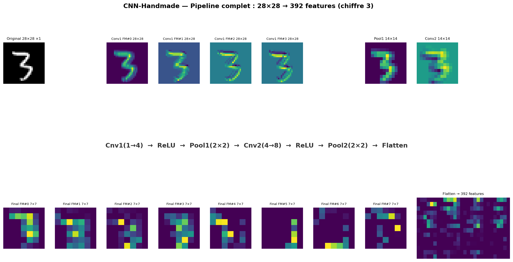
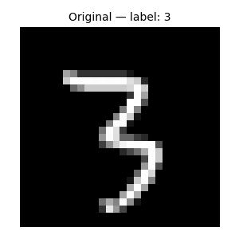
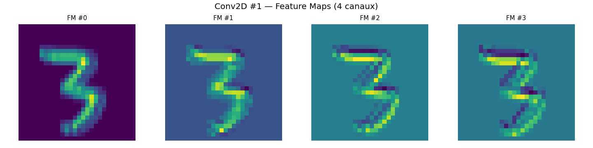
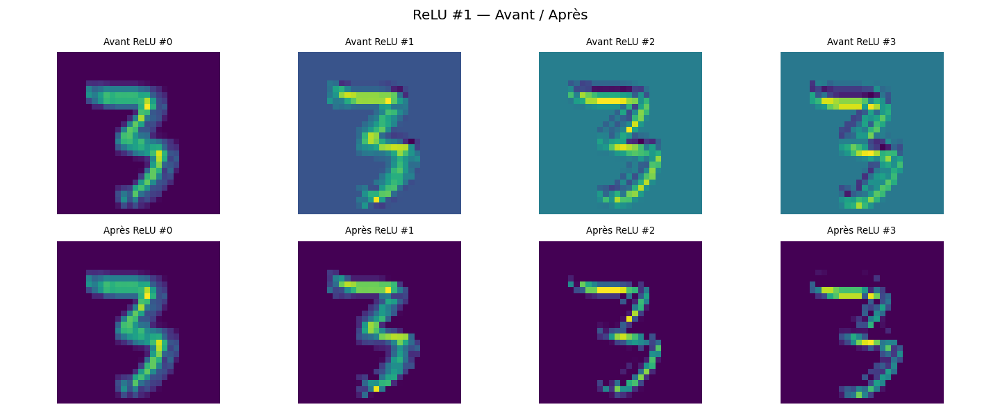
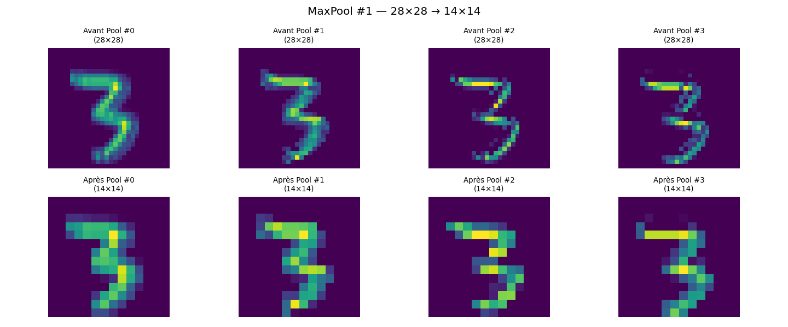
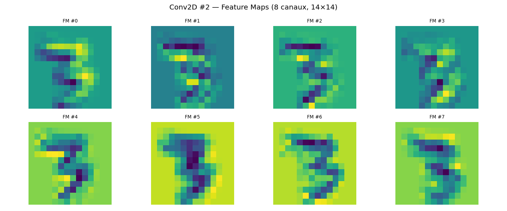
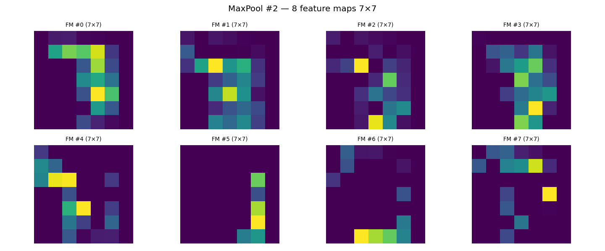

# 🔬 Data Flow — Cheminement d'une image dans CNN-Handmade

## Introduction

Ce document trace le parcours complet d'une **image MNIST réelle** (chiffre 3, index 44 du train set) à travers toutes les couches du réseau.

Chaque étape montre :
- Les **dimensions** qui changent
- Les **valeurs** concrètes (min, max, mean, échantillons)
- Ce que la couche **fait conceptuellement**
- Les **images** des feature maps générées

> Le script qui génère cette trace est dans [`traces/forward_trace.py`](../traces/forward_trace.py).
> Pour le relancer : `python3 traces/forward_trace.py`
> Résultats dans `traces/out/`.

---

## 🖼️ Image récapitulative du pipeline



---

## Étape 1 : Chargement MNIST

### Format des données

MNIST contient des images **niveaux de gris** de **chiffres manuscrits** (0-9), en 28×28 pixels.

| Dataset | Échantillons | Format fichier |
|---|---|---|
| Train | 60 000 | IDX (binaire) |
| Test | 10 000 | IDX (binaire) |

### Code

```python
loader = MNISTLoader()
(x_train, y_train), (x_test, y_test) = loader.load("data/")
```

### Ce qui se passe

```python
# Lecture du fichier binaire IDX
with open(filepath, 'rb') as f:
    magic, size, rows, cols = struct.unpack(">IIII", f.read(16))
    data = array("B", f.read())
```

On lit 16 octets d'en-tête (magic number + dimensions), puis le reste des pixels. Chaque pixel = 1 octet (0–255).

### Chiffre sélectionné

```
Index     : 44
Label     : 3
Shape     : (28, 28)
Type      : float32
Min pixel : 0
Max pixel : 255
```



### Aperçu pixels (coin haut-gauche 8×8)

```
[[  0   0   0   0   0   0   0   0]
 [  0   0   0   0   0   0   0   0]
 [  0   0   0   0   0   0   0   0]
 [  0   0   0   0   0   0   0   0]
 [  0   0   0   0   0   0   0   0]
 [  0   0   0   0   0   0   0   0]
 [  0   0   0   0   0   0   0 163]
 [  0   0   0   0   0   0 203 253]]
```

Le fond est noir (0), le chiffre commence à apparaître au pixel (6,6) avec valeur 163.

---

## Étape 2 : Prétraitement

### Normalisation [0, 255] → [0.0, 1.0]

```python
def normalize(images):
    return images / 255.0
```

**Pourquoi ?** Les réseaux de neurones convergent mieux quand les entrées sont dans un intervalle stable (typiquement [0,1] ou [-1,1]).

```
Avant : min=0, max=255
Après : min=0.0, max=1.0
```

### Ajout de la dimension canal

```python
def add_channel_dim(images):
    return images[..., np.newaxis]
```

MNIST est en niveaux de gris → 1 seul canal.

```
Avant : (28, 28)
Après : (28, 28, 1)
```

### Ajout de la dimension batch

```python
image = image[np.newaxis, ...]  # (1, 28, 28, 1)
```

### Transposition channels_first

La convolution utilise le format `(N, C, H, W)` — c'est le format standard en interne.

```python
image = image.transpose(0, 3, 1, 2)
```

```
Avant  : (1, 28, 28, 1)   — (N, H, W, C)
Après  : (1, 1, 28, 28)   — (N, C, H, W)
```

| Étape | Shape |
|---|---|
| Originale | `(28, 28)` |
| Normalisée | `(28, 28)` |
| + Canal | `(28, 28, 1)` |
| + Batch | `(1, 28, 28, 1)` |
| Channels first | `(1, 1, 28, 28)` |

---

## Étape 3 : Conv2D #1 — 1 → 4 canaux

### La couche

```python
Conv2D(in_channels=1, out_channels=4, kernel_size=3, stride=1, pad=1)
```

| Paramètre | Valeur |
|---|---|
| Canaux d'entrée | 1 (niveaux de gris) |
| Canaux de sortie | 4 (filtres) |
| Taille kernel | 3×3 |
| Stride | 1 |
| Padding | 1 (conserve la taille) |

### Poids

Les **kernels** sont initialisés aléatoirement avec **He initialization** :

```python
fan_in = in_channels * kernel_size * kernel_size
self.kernels = np.random.randn(...) * np.sqrt(2.0 / fan_in)
```

Chaque kernel = 3×3 = 9 poids. 4 kernels × 1 canal d'entrée.

```
Shape des poids : (4, 1, 3, 3)
```

Exemple du kernel #0 :

```
[[ 0.47, -0.20,  0.55],
 [ 0.14, -0.40,  0.84],
 [ 0.26,  0.06,  0.42]]
```

### Comment ça marche : im2col

Au lieu de boucler pixel par pixel (lent), on utilise **im2col** :

1. On découpe l'image en **tous les patchs** que le kernel va visiter
2. Chaque patch devient une **colonne** d'une grande matrice
3. Les kernels sont **aplatis** en une matrice
4. La convolution = **produit matriciel** entre les deux

```python
def im2col(images, kernel_h, kernel_w, stride, pad):
    # ...
    # Pour chaque position (y, x) du kernel :
    for y in range(H_out):
        for x in range(W_out):
            patch = images[:, :, y*stride:y*stride+kH, x*stride:x*stride+kW]
            cols[idx::H_out*W_out] = patch.reshape(N, -1)
    return cols, H_out, W_out
```

### Sortie

```
Shape : (1, 4, 28, 28)   — inchangée grâce à pad=1
Min   : -0.687
Max   : 1.976
Mean  : 0.092
```

Chaque canal de sortie est une **feature map** : elle représente la réponse du kernel à différentes zones de l'image. Les valeurs positives indiquent une forte correspondance entre le kernel et la région de l'image.



> Les valeurs négatives apparaissent quand le kernel "inverse" ne correspond pas — elles seront tuées par ReLU juste après.

Aperçu de la feature map #0 (coin 6×6) :

```
[[0.    0.    0.    0.    0.    0.   ]
 [0.    0.    0.    0.    0.    0.   ]
 [0.    0.    0.    0.    0.    0.   ]
 [0.    0.    0.    0.    0.    0.   ]
 [0.    0.    0.    0.    0.    0.   ]
 [0.    0.    0.    0.    0.    0.27 ]]
```

Les bords en haut à gauche sont à 0 (fond noir), ça commence à s'activer là où le chiffre 3 apparaît.

---

## Étape 4 : ReLU #1

### La couche

```python
class ReLU:
    def forward(self, x):
        self.mask = x > 0
        return np.maximum(0, x)
```

**ReLU = Rectified Linear Unit.** C'est l'activation la plus utilisée :
- Si x > 0 → on laisse passer
- Si x ≤ 0 → on tue (→ 0)

**Pourquoi c'est important ?** Sans non-linéarité, empiler des couches linéaires reviendrait à une seule couche. ReLU apporte la non-linéarité.

### Statistiques

```
Avant ReLU  : min = -0.687  max = 1.976
Après ReLU  : min =  0.0    max = 1.976
Négatifs tués : 202 valeurs (sur 4×28×28 = 3136 total)
```



> Les zones bleues dans "Avant" sont les valeurs négatives → mises à 0 (noir dans "Après").

---

## Étape 5 : MaxPool #1 — 28×28 → 14×14

### La couche

```python
MaxPool2D(pool_size=2, stride=2)
```

| Paramètre | Valeur |
|---|---|
| Taille fenêtre | 2×2 |
| Stride | 2 (pas de chevauchement) |

### Comment ça marche

On découpe chaque feature map en fenêtres de 2×2. Dans chaque fenêtre, on ne garde que la **valeur maximale**.

```
Fenêtre 2×2 :
┌────┬────┐     ┌────┐
│ 0  │ 0  │     │    │
├────┼────┤  →  │  0 │   ← max(0, 0, 0, 0)
│ 0  │ 0  │     │    │
└────┴────┘     └────┘
```

**Pourquoi MaxPool ?**
- Réduit la dimension spatiale (moins de paramètres)
- Rend le réseau **invariant aux petites translations** (si le chiffre bouge un peu, le max reste similaire)
- Extrait les **caractéristiques dominantes**

### Statistiques

```
Entrée : (1, 4, 28, 28)  →  28×28
Sortie : (1, 4, 14, 14)  →  14×14
```

La dimension spatiale est divisée par 2. Le nombre de canaux reste identique.



### Vérification

```python
Fenêtre top-left de FM#0 :
[[0. 0.]
 [0. 0.]]
Max retenu : 0.0  ✅
```

---

## Étape 6 : Conv2D #2 — 4 → 8 canaux

### La couche

```python
Conv2D(in_channels=4, out_channels=8, kernel_size=3, stride=1, pad=1)
```

Cette fois, on a **4 canaux en entrée** (les feature maps du premier bloc). Chacun des 8 kernels de sortie traite **tous les 4 canaux d'entrée simultanément**.

### Poids

```
Shape des poids : (8, 4, 3, 3)
```

Chaque kernel de sortie = 4 canaux × 3×3 = **36 poids**, plus le biais. Au total : 8 × 36 = 288 poids.

### Sortie

```
Shape : (1, 8, 14, 14)
Min   : -2.998
Max   : 1.733
Mean  : -0.206
```

Les feature maps de la deuxième couche capturent des motifs plus complexes que la première — combinaisons de traits simples pour former des parties de chiffres.



---

## Étape 7 : ReLU #2

Même principe que précédemment, appliqué aux 8 feature maps 14×14.

```
Négatifs tués : 583 valeurs mises à 0
Activation totale : 93.02
```

---

## Étape 8 : MaxPool #2 — 14×14 → 7×7

### Statistiques

```
Entrée : (1, 8, 14, 14)  →  14×14
Sortie : (1, 8, 7, 7)    →   7×7
```

Après deux blocs Conv+Pool :
- **Spatialement** : 28×28 → 7×7 (réduction 16×)
- **Profondeur** : 1 canal → 8 canaux
- L'image initiale a été transformée en **8 cartes de caractéristiques** de 7×7 pixels



Chacune des 8 images 7×7 ci-dessus représente ce qu'un filtre spécifique a détecté dans le chiffre 3. Par exemple :
- FM #5 et #6 réagissent fortement à certaines courbes du 3
- FM #2 semble détecter des traits horizontaux

---

## Étape 9 : Flatten — (1, 8, 7, 7) → (1, 392)

### La couche

```python
class Flatten:
    def forward(self, x):
        self.input_shape = x.shape
        N = x.shape[0]
        return x.reshape(N, -1)
```

**Rôle :** Pont entre les couches convolutionnelles (spatiales) et les couches **fully connected** (vectorielles).

```
Avant  : (1, 8, 7, 7)
Après  : (1, 392)
Vérif  : 8 × 7 × 7 = 392 ✅
```

### À quoi ressemble le vecteur ?

```
Premières 10 valeurs : [0.0, 0.124, 0.133, 0.025, 0.019, 0.0, 0.0, 0.0, 0.999, 1.380]
Min  : 0.0
Max  : 1.733
Mean : 0.134
```

C'est ce vecteur de **392 features** qui servira d'entrée aux couches Dense pour classifier le chiffre.

---

## Récapitulatif complet

| Étape | Couche | Shape entrée | Shape sortie | Info |
|---|---|---|---|---|
| 1 | Chargement | — | `(28, 28)` | Image brute en niveaux de gris |
| 2 | Normalisation | `(28, 28)` | `(28, 28)` | Pixels dans [0, 1] |
| 2 | + Canal + Batch | `(28, 28)` | `(1, 1, 28, 28)` | Format réseau |
| 3 | **Conv2D** (1→4) | `(1, 1, 28, 28)` | `(1, 4, 28, 28)` | 4 feature maps |
| 4 | **ReLU** | `(1, 4, 28, 28)` | `(1, 4, 28, 28)` | Non-linéarité |
| 5 | **MaxPool** (2×2) | `(1, 4, 28, 28)` | `(1, 4, 14, 14)` | Sous-échantillonnage |
| 6 | **Conv2D** (4→8) | `(1, 4, 14, 14)` | `(1, 8, 14, 14)` | 8 feature maps |
| 7 | **ReLU** | `(1, 8, 14, 14)` | `(1, 8, 14, 14)` | Non-linéarité |
| 8 | **MaxPool** (2×2) | `(1, 8, 14, 14)` | `(1, 8, 7, 7)` | Sous-échantillonnage |
| 9 | **Flatten** | `(1, 8, 7, 7)` | `(1, 392)` | Vecteur prêt pour Dense |

### Une image...

```
  28×28 pixels                 392 features
  ┌─────────┐                ┌──────────────┐
  │         │  ── 2 blocs ──▶│  [0.0 0.124  │
  │   3     │   Conv+Pool+   │   0.133 ...  │
  │         │   ReLU+Flatten │    ...  ]    │
  └─────────┘                └──────────────┘
```

### ... vers une classification

**Ce qu'il reste à faire** (pas encore implémenté) :

| À venir | Rôle |
|---|---|
| **Dense** (3136→128) | Première couche fully-connected |
| **ReLU** | Activation |
| **Dense** (128→10) | Projection vers 10 classes |
| **Softmax** | Conversion en probabilités |
| **Cross-Entropy** | Calcul de la perte |

L'architecture finale prévue :

```
Conv2D(1→32, k=3, p=1) → ReLU → MaxPool(2×2)
  → Conv2D(32→64, k=3, p=1) → ReLU → MaxPool(2×2)
    → Flatten (3136)
      → Dense(3136→128) → ReLU
        → Dense(128→10)
          → Softmax → Cross-Entropy Loss
```

---

## Pour aller plus loin

- Lancer la trace soi-même : `python3 traces/forward_trace.py`
- Modifier le chiffre sélectionné dans le script (variable `target_digit`)
- Les images de trace sont dans `traces/out/`
- Code source des couches : `src/cnn.py`

---

*Document généré avec des données réelles depuis `traces/forward_trace.py`*
*CNN-Handmade — #NoFrameworks #FromScratch*
